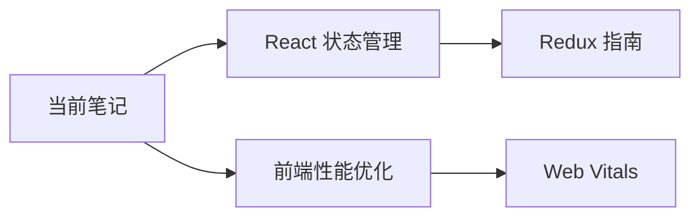

# 管理笔记链接

你需要帮助用户管理 Obsidian vault 中笔记之间的链接关系，包括查找双向链接、检测断链、建议相关笔记等。

## 参数
- 笔记路径：$ARGUMENTS 的第一个参数（可选）
- 操作类型：$ARGUMENTS 的第二个参数（backlinks、broken、suggest）

## 功能模块

### 1. 查找双向链接（Backlinks）

查找指定笔记的所有链接关系：
- **出链（Outgoing Links）**：当前笔记链接到的其他笔记
- **入链（Backlinks）**：链接到当前笔记的其他笔记

**步骤**：
1. 如果用户没有指定笔记，询问要分析哪个笔记
2. 读取笔记内容
3. 查找所有 Wiki 链接：`[[笔记标题]]` 或 `[[笔记标题|别名]]`
4. 在整个 vault 中搜索指向该笔记的链接
5. 生成链接关系图

**输出格式**：
```markdown
## 笔记链接分析：[笔记标题]

### 📤 出链（当前笔记链接到）
找到 N 个链接：
- [[笔记A]] - 在第 10 行
- [[笔记B]] - 在第 15, 23 行
- [[笔记C|别名]] - 在第 30 行

### 📥 入链（链接到当前笔记）
找到 M 个反向链接：
- [[引用者笔记1]] - 在其第 5 行
- [[引用者笔记2]] - 在其第 12 行

### 🔗 链接强度分析
- 高频链接笔记：[[笔记B]]（3次引用）
- 孤立链接：[[笔记C]]（仅1次引用）

### 💡 建议
- 考虑为 [[笔记B]] 创建独立的笔记页面
- [[笔记A]] 可能与当前主题高度相关，建议深入关联
```

### 2. 检测断链（Broken Links）

查找 vault 中所有的断链（指向不存在笔记的链接）：

**步骤**：
1. 指定检查范围（单个笔记、目录或整个 vault）
2. 提取所有 Wiki 链接
3. 检查目标笔记是否存在
4. 列出所有断链及其位置
5. 提供修复建议

**输出格式**：
```markdown
## 断链检测报告

### ⚠️ 发现的断链

#### 1. 在 [笔记X](路径) 中
- **第 10 行**：[[不存在的笔记A]]
  - **建议**：创建该笔记 或 修改链接为：[[存在的笔记A]]

- **第 25 行**：[[老笔记名称]]
  - **建议**：该笔记可能被重命名为 [[新笔记名称]]

#### 2. 在 [笔记Y](路径) 中
- **第 8 行**：[[已删除的笔记]]
  - **建议**：移除该链接或创建新笔记

### 📊 统计
- 总检查笔记数：50
- 发现断链数：8
- 涉及笔记数：5

### 🔧 快速修复
是否需要：
1. 批量创建缺失的笔记？
2. 自动更新重命名的链接？
3. 移除指向已删除笔记的链接？
```

### 3. 建议相关笔记（Suggest Related）

基于内容相似度、共同标签、链接关系建议相关笔记：

**步骤**：
1. 分析当前笔记的内容、标签、现有链接
2. 在 vault 中查找相似笔记
3. 使用以下维度评分：
   - 标签重叠度
   - 内容关键词相似度
   - 共同链接的笔记数
   - 创建时间接近度
4. 排序并推荐 top 5-10 个相关笔记
5. 建议添加链接的具体位置

**输出格式**：
```markdown
## 相关笔记推荐：[当前笔记]

### 🎯 高度相关（相似度 > 80%）

#### 1. [[React 状态管理]] - 相似度 92%
**相关原因**：
- 共同标签：#react #javascript #state-management
- 内容关键词匹配：useState, Redux, Context
- 已有共同链接：[[React 基础]]

**建议添加位置**：
- 在「状态管理」章节添加链接（第 45 行附近）

#### 2. [[前端性能优化]] - 相似度 85%
**相关原因**：
- 共同标签：#react #performance
- 内容主题相关：组件渲染优化

**建议添加位置**：
- 在「性能考虑」章节添加链接（第 78 行附近）

### 📚 中等相关（相似度 60-80%）

#### 3. [[JavaScript 闭包详解]] - 相似度 72%
#### 4. [[Hooks 最佳实践]] - 相似度 68%

### 💭 可能相关（相似度 40-60%）

#### 5. [[TypeScript 类型系统]] - 相似度 55%

### 🔗 建议的链接网络

```

## 高级功能

### 链接自动补全
当用户编写笔记时，基于上下文建议可能的链接：
```
用户输入：「React Hooks 提供了一种新的方式来...」
建议：在「React Hooks」处添加链接 → [[React Hooks 深入理解]]
```

### 链接健康检查
定期（或按需）检查：
- 断链数量
- 孤立笔记（没有任何链接的笔记）
- 过度链接（链接过多可能影响阅读）
- 循环引用

### 链接可视化
生成 Mermaid 图表展示笔记之间的链接关系。

## 最佳实践建议

1. **避免断链**：
   - 重命名笔记时自动更新所有引用
   - 删除笔记前检查反向链接

2. **合理链接**：
   - 每个笔记保持 3-10 个有意义的链接
   - 避免过度链接影响阅读体验

3. **构建知识网络**：
   - 定期使用「建议相关笔记」功能
   - 关注高频出现但未链接的概念

4. **维护链接健康**：
   - 每周运行一次断链检测
   - 每月审查孤立笔记

## 示例用法

```bash
# 查看笔记的双向链接
/note-link "Projects/React/学习 React Hooks.md" backlinks

# 检测整个 vault 的断链
/note-link broken

# 检测特定目录的断链
/note-link "Projects/" broken

# 为笔记建议相关内容
/note-link "Learning/JavaScript 闭包.md" suggest

# 不带参数调用，交互式选择
/note-link
```

## 注意事项
- 处理大型 vault 时可能需要较长时间
- 确保备份后再进行批量修复操作
- 尊重用户的笔记结构，不要强制添加链接
- 建议的相关笔记基于算法，可能需要人工判断
