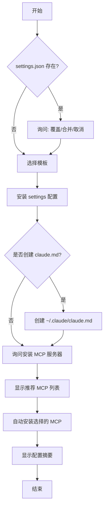
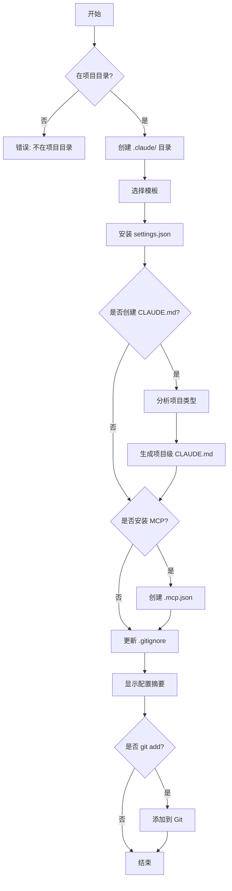

# Claude Conf 配置管理增强 PRD

## 文档信息

- **产品名称**: claude-conf
- **版本**: 3.0.0
- **文档版本**: 1.0
- **创建日期**: 2025-10-23
- **作者**: Code Infra Team

---

## 1. 产品背景

### 1.1 Claude Code 配置系统

Claude Code 是 Anthropic 推出的 AI 辅助编程工具，拥有复杂的配置系统：

**配置文件体系**：
- `~/.claude/settings.json` - 用户全局配置
- `~/.claude.json` - 内部状态文件（MCP 服务器、使用统计）
- `~/.claude/claude.md` - 用户全局指令
- `.claude/settings.json` - 项目共享配置（提交到 Git）
- `.claude/settings.local.json` - 项目本地配置（不提交）
- `CLAUDE.md` - 项目级指令
- `.mcp.json` - 项目 MCP 服务器配置

**配置优先级**（从高到低）：
1. 企业托管策略
2. 命令行参数
3. 本地项目配置
4. 共享项目配置
5. 用户全局配置

### 1.2 用户痛点

**痛点 1: 新电脑配置复杂**
- 需要手动创建多个配置文件
- 不清楚哪些配置是必需的
- MCP 服务器需要逐个安装
- 缺少配置验证机制

**痛点 2: 新项目初始化繁琐**
- 需要手动创建 `.claude/` 目录结构
- 不知道该使用什么配置
- CLAUDE.md 需要从头编写
- 容易遗漏 .gitignore 配置

**痛点 3: 配置检查困难**
- 不知道配置是否正确
- 配置错误难以发现
- 缺少最佳实践指导
- 团队配置不一致

### 1.3 当前工具现状

`claude-conf` (v2.0) 当前功能：
- ✅ 模板化安装 Settings 配置
- ✅ 智能 scope 推荐
- ✅ MCP 自动安装（user/local scope）
- ✅ 配置合并/替换策略
- ❌ 缺少全局初始化
- ❌ 缺少项目初始化
- ❌ 缺少配置检查
- ❌ 缺少自动修复

---

## 2. 产品目标

### 2.1 核心目标

1. **简化初始化流程** - 一条命令完成全局/项目配置
2. **提供配置检查** - 自动验证配置完整性和正确性
3. **自动诊断修复** - 发现并修复常见配置问题
4. **标准化配置** - 提供最佳实践模板

### 2.2 成功指标

- 新电脑配置时间从 30 分钟缩短到 5 分钟
- 新项目配置时间从 15 分钟缩短到 2 分钟
- 配置错误率降低 80%
- 团队配置一致性达到 95%

---

## 3. 功能需求

### 3.1 `init` 命令 - 全局初始化

#### 3.1.1 命令格式

```bash
claude-conf init [template] [options]

Options:
  --template <name>       模板名称 (common|yolo)
  --with-claude-md        同时创建 claude.md
  --mcp <servers>         指定 MCP 服务器列表（逗号分隔）
  --yes                   跳过所有确认提示
```

#### 3.1.2 执行流程



#### 3.1.3 交互示例

```
📦 Claude Code 全局初始化

✓ 检测到现有配置: ~/.claude/settings.json
? 如何处理现有配置？
  › 合并配置（推荐）
    替换配置
    取消操作

✓ 选择模板: common
✓ 安装 Settings 配置
  → 配置路径: ~/.claude/settings.json
  → 策略: 合并

? 是否创建 ~/.claude/claude.md？
  › 是（推荐）
    否

✓ 创建 claude.md
  → 使用模板: templates/claude.md.user.template

📦 MCP 服务器推荐

开发工具:
  ☑ serena - 代码理解和编辑
  ☑ sequential-thinking - 深度推理
  ☐ filesystem - 增强文件操作

生产力工具:
  ☑ memory - 会话记忆
  ☐ fetch - HTTP 请求

数据工具:
  ☑ firecrawl - 网页抓取
  ☐ sqlite - 数据库操作

? 选择要安装的 MCP 服务器：(Space 选择, Enter 确认)
  ✓ 已选择 4 个服务器

⠋ 正在安装 MCP 服务器...
  ✓ serena - 安装成功
  ✓ sequential-thinking - 安装成功
  ✓ memory - 安装成功
  ✓ firecrawl - 安装成功

✓ 初始化完成！

配置摘要:
  Settings: ~/.claude/settings.json
  CLAUDE.md: ~/.claude/claude.md
  MCP 服务器: 4 个已安装

下一步:
  运行 'claude-conf check' 验证配置
```

#### 3.1.4 功能清单

- [ ] 检测现有配置并提供处理选项
- [ ] 模板选择（默认 common）
- [ ] 安装 settings.json
- [ ] 可选创建 claude.md（使用模板）
- [ ] 显示推荐 MCP 服务器列表（分类展示）
- [ ] 批量安装 MCP 服务器
- [ ] 显示详细的配置摘要
- [ ] 提供下一步操作建议

### 3.2 `init-project` 命令 - 项目初始化

#### 3.2.1 命令格式

```bash
claude-conf init-project [template] [options]

Options:
  --template <name>       模板名称 (common|yolo)
  --with-claude-md        同时创建 CLAUDE.md
  --mcp <servers>         指定 MCP 服务器列表
  --git-add               自动添加配置到 Git
  --yes                   跳过所有确认提示
```

#### 3.2.2 执行流程



#### 3.2.3 项目类型识别

根据 `package.json` 自动识别项目类型并生成对应的 CLAUDE.md：

| 项目类型 | 识别条件 | CLAUDE.md 内容 |
|---------|---------|---------------|
| Next.js | dependencies 包含 `next` | Next.js 项目规范 |
| React | dependencies 包含 `react` | React 项目规范 |
| Vue | dependencies 包含 `vue` | Vue 项目规范 |
| Node.js Library | type: module, 无框架 | Node.js 库规范 |
| TypeScript | devDependencies 包含 `typescript` | TypeScript 规范 |
| Monorepo | 包含 `workspaces` | Monorepo 管理规范 |

#### 3.2.4 功能清单

- [ ] 检测是否在项目目录
- [ ] 创建 `.claude/` 目录结构
- [ ] 安装 `.claude/settings.json`
- [ ] 识别项目类型
- [ ] 生成项目级 `CLAUDE.md`
- [ ] 创建 `.mcp.json`（如果需要）
- [ ] 更新 `.gitignore`（添加 `settings.local.json`）
- [ ] 可选自动 `git add`
- [ ] 显示配置摘要

### 3.3 `check` 命令 - 配置检查清单

#### 3.3.1 命令格式

```bash
claude-conf check [options]

Options:
  --scope <scope>         检查范围 (user|project|all)
  --verbose               显示详细信息
  --json                  JSON 格式输出
```

#### 3.3.2 检查项设计

**User Scope 检查项**：

| 检查项 | 重要性 | 检查逻辑 |
|-------|--------|---------|
| settings.json 存在 | 必需 | 检查文件是否存在 |
| settings.json 有效 | 必需 | JSON 格式验证 |
| 权限配置完整 | 推荐 | 检查 allow/deny 规则 |
| .env 文件保护 | 推荐 | deny 列表包含 `.env*` |
| claude.md 存在 | 可选 | 检查文件是否存在 |
| MCP 服务器配置 | 可选 | 解析 ~/.claude.json |
| 推荐 MCP 已安装 | 推荐 | 检查常用 MCP 服务器 |

**Project Scope 检查项**：

| 检查项 | 重要性 | 检查逻辑 |
|-------|--------|---------|
| .claude/ 目录存在 | 必需 | 检查目录 |
| settings.json 存在 | 必需 | 检查文件 |
| settings.json 有效 | 必需 | JSON 验证 |
| CLAUDE.md 存在 | 推荐 | 检查文件 |
| .mcp.json 存在 | 可选 | 检查文件 |
| .mcp.json 有效 | 可选 | JSON 验证 |
| .gitignore 配置 | 推荐 | 检查 settings.local.json |
| 权限配置合理 | 推荐 | 检查 deny 规则 |

#### 3.3.3 输出格式

```
📋 Claude Code 配置检查清单

━━━━━━━━━━━━━━━━━━━━━━━━━━━━━━━━━━━━━━━━━━━━━━━━━━━━
全局配置 (User Scope)
━━━━━━━━━━━━━━━━━━━━━━━━━━━━━━━━━━━━━━━━━━━━━━━━━━━━

  必需配置:
    ✅ settings.json - 存在且有效
    ✅ JSON 格式 - 验证通过

  推荐配置:
    ✅ claude.md - 存在
    ✅ 权限配置 - 已配置 allow/deny 规则
    ⚠️  .env 保护 - 建议添加 .env* 到 deny 列表

  MCP 服务器:
    ✅ 已安装 4 个服务器
    ✓ serena
    ✓ sequential-thinking
    ✓ memory
    ✓ firecrawl
    ⚠️  建议安装: filesystem

━━━━━━━━━━━━━━━━━━━━━━━━━━━━━━━━━━━━━━━━━━━━━━━━━━━━
项目配置 (Project Scope)
━━━━━━━━━━━━━━━━━━━━━━━━━━━━━━━━━━━━━━━━━━━━━━━━━━━━

  必需配置:
    ✅ .claude/ 目录 - 存在
    ✅ settings.json - 存在且有效

  推荐配置:
    ✅ CLAUDE.md - 存在
    ❌ .mcp.json - 不存在
    ⚠️  .gitignore - 缺少 settings.local.json

  权限配置:
    ✅ 已配置 deny 规则
    ✓ node_modules/**
    ✓ .git/**
    ✓ dist/**
    ⚠️  建议添加: .env*, **/.env*

━━━━━━━━━━━━━━━━━━━━━━━━━━━━━━━━━━━━━━━━━━━━━━━━━━━━
配置评分: 85/100
━━━━━━━━━━━━━━━━━━━━━━━━━━━━━━━━━━━━━━━━━━━━━━━━━━━━

建议操作:
  1. 添加 .env* 到全局 settings 的 deny 列表
  2. 运行 'claude-conf init-project --mcp' 创建 .mcp.json
  3. 添加 'settings.local.json' 到 .gitignore
  4. 考虑安装 filesystem MCP 服务器

💡 提示:
  运行 'claude-conf doctor --fix' 自动修复这些问题
```

#### 3.3.4 功能清单

- [ ] User scope 完整性检查
- [ ] Project scope 完整性检查
- [ ] JSON 格式验证
- [ ] 权限配置合理性检查
- [ ] MCP 服务器配置检查
- [ ] .gitignore 配置检查
- [ ] 配置评分算法
- [ ] 分类显示检查结果（必需/推荐/可选）
- [ ] 提供具体的修复建议
- [ ] 支持 --verbose 详细模式
- [ ] 支持 --json 格式输出

### 3.4 `doctor` 命令 - 自动诊断修复

#### 3.4.1 命令格式

```bash
claude-conf doctor [options]

Options:
  --fix                   自动修复问题
  --scope <scope>         诊断范围 (user|project|all)
  --dry-run               仅显示修复计划，不实际执行
```

#### 3.4.2 诊断项设计

| 问题类型 | 检测逻辑 | 修复方案 |
|---------|---------|---------|
| 缺失 settings.json | 文件不存在 | 创建默认配置 |
| settings.json 格式错误 | JSON 解析失败 | 备份并重新创建 |
| 权限配置缺失 .env 保护 | deny 列表不包含 .env | 添加到 deny 列表 |
| .gitignore 缺失配置 | 不包含 settings.local.json | 添加条目 |
| MCP 配置错误 | .mcp.json 格式错误 | 备份并提供修复建议 |
| 项目缺少 CLAUDE.md | 文件不存在 | 生成默认模板 |
| 权限过于宽松 | allow: ["**/*"], deny: [] | 添加推荐的 deny 规则 |

#### 3.4.3 交互示例

```
🔍 Claude Code 配置诊断

扫描配置文件...

━━━━━━━━━━━━━━━━━━━━━━━━━━━━━━━━━━━━━━━━━━━━━━━━━━━━
发现 3 个问题
━━━━━━━━━━━━━━━━━━━━━━━━━━━━━━━━━━━━━━━━━━━━━━━━━━━━

1. ⚠️  权限配置 - .env 文件未保护
   位置: ~/.claude/settings.json
   建议: 添加 .env* 到 deny 列表
   严重性: 中

2. ❌ .gitignore 配置缺失
   位置: .gitignore
   问题: 缺少 settings.local.json
   严重性: 高

3. ⚠️  MCP 服务器配置
   位置: 项目 .mcp.json
   问题: 文件不存在
   严重性: 低

━━━━━━━━━━━━━━━━━━━━━━━━━━━━━━━━━━━━━━━━━━━━━━━━━━━━

? 是否自动修复这些问题？
  › 是 - 修复所有问题
    否 - 仅显示建议
    选择性修复

✓ 修复问题 1: 更新权限配置
  → 添加 .env* 到 deny 列表
  → 添加 **/.env* 到 deny 列表

✓ 修复问题 2: 更新 .gitignore
  → 添加 .claude/settings.local.json

⊙ 跳过问题 3: MCP 配置（可选）
  提示: 运行 'claude-conf init-project --mcp' 创建

━━━━━━━━━━━━━━━━━━━━━━━━━━━━━━━━━━━━━━━━━━━━━━━━━━━━
✓ 修复完成
━━━━━━━━━━━━━━━━━━━━━━━━━━━━━━━━━━━━━━━━━━━━━━━━━━━━

修复摘要:
  ✓ 2 个问题已修复
  ⊙ 1 个问题已跳过

下一步:
  运行 'claude-conf check' 验证修复结果
```

#### 3.4.4 功能清单

- [ ] 自动扫描配置问题
- [ ] 问题分类和严重性评估
- [ ] 提供详细的修复建议
- [ ] 支持 --fix 自动修复
- [ ] 支持 --dry-run 预览
- [ ] 修复前自动备份
- [ ] 选择性修复功能
- [ ] 修复结果摘要
- [ ] 提供后续操作建议

### 3.5 扩展 `install` 命令

#### 3.5.1 新增功能

**功能 1: 支持安装 CLAUDE.md**

```bash
claude-conf install common --with-claude-md
```

**功能 2: 支持指定 MCP 服务器**

```bash
claude-conf install common --mcp serena,sequential-thinking,firecrawl
```

**功能 3: 支持批量安装**

```bash
claude-conf install common \
  --scope user \
  --with-claude-md \
  --mcp serena,memory \
  --yes
```

#### 3.5.2 改进点

- [ ] 添加 `--with-claude-md` 选项
- [ ] 添加 `--mcp <list>` 选项
- [ ] 添加 `--yes` 跳过确认
- [ ] 改进预览显示
- [ ] 添加安装后验证

---

## 4. 技术设计

### 4.1 文件结构

```
src/
├── cli.ts                    (40 行) - CLI 入口
├── types.ts                  (80 行) - 类型定义（新增）
├── utils.ts                  (200 行) - 工具函数（扩展）
├── validators.ts             (100 行) - 配置验证（新增）
├── templates-manager.ts      (100 行) - 模板管理（新增）
└── commands/
    ├── init.ts               (180 行) - 全局初始化（新增）
    ├── init-project.ts       (220 行) - 项目初始化（新增）
    ├── check.ts              (180 行) - 配置检查（新增）
    ├── doctor.ts             (200 行) - 自动诊断（新增）
    ├── install.ts            (450 行) - 安装命令（扩展）
    └── list.ts               (30 行) - 列表命令

templates/
├── common.json               - Settings 模板
├── common.mcp.json           - MCP 模板
├── yolo.json                 - YOLO 模板
├── yolo.mcp.json             - YOLO MCP 模板
├── claude.md.user.template   (新增) - 用户全局指令模板
├── CLAUDE.md.project.template (新增) - 项目级指令模板
├── .gitignore.template       (新增) - .gitignore 模板
└── recommended-mcp.json      (新增) - 推荐 MCP 列表
```

### 4.2 新增类型定义

```typescript
// src/types.ts

/** 检查结果 */
export interface CheckResult {
  scope: 'user' | 'project'
  category: 'required' | 'recommended' | 'optional'
  item: string
  status: 'pass' | 'warning' | 'fail'
  message: string
  fixable: boolean
}

/** 诊断问题 */
export interface DiagnosticIssue {
  id: string
  type: 'missing' | 'invalid' | 'misconfigured'
  severity: 'low' | 'medium' | 'high'
  location: string
  description: string
  suggestion: string
  fixable: boolean
  fix?: () => Promise<void>
}

/** MCP 服务器元数据 */
export interface McpServerMeta {
  name: string
  description: string
  category: 'development' | 'productivity' | 'data'
  recommended: boolean
  command: string
  args: string[]
  env?: Record<string, string>
}

/** 项目类型 */
export type ProjectType =
  | 'nextjs'
  | 'react'
  | 'vue'
  | 'nodejs'
  | 'typescript'
  | 'monorepo'
  | 'unknown'

/** 配置评分 */
export interface ConfigScore {
  total: number
  user: number
  project: number
  issues: DiagnosticIssue[]
  suggestions: string[]
}
```

### 4.3 模板管理器

```typescript
// src/templates-manager.ts

export class TemplatesManager {
  /** 加载 CLAUDE.md 用户模板 */
  async loadUserClaudeMdTemplate(): Promise<string>

  /** 加载项目 CLAUDE.md 模板 */
  async loadProjectClaudeMdTemplate(projectType: ProjectType): Promise<string>

  /** 加载推荐 MCP 列表 */
  async loadRecommendedMcp(): Promise<McpServerMeta[]>

  /** 加载 .gitignore 模板 */
  async loadGitignoreTemplate(): Promise<string>
}
```

### 4.4 配置验证器

```typescript
// src/validators.ts

export class ConfigValidator {
  /** 验证 settings.json */
  validateSettings(settings: any): CheckResult[]

  /** 验证权限配置 */
  validatePermissions(permissions: any): CheckResult[]

  /** 验证 MCP 配置 */
  validateMcpConfig(mcpConfig: any): CheckResult[]

  /** 检查 .gitignore */
  checkGitignore(gitignorePath: string): CheckResult[]

  /** 计算配置评分 */
  calculateScore(results: CheckResult[]): ConfigScore
}
```

### 4.5 代码量估算

| 模块 | 当前行数 | 新增行数 | 总计 |
|-----|---------|---------|------|
| src/cli.ts | 40 | +20 | 60 |
| src/types.ts | 48 | +32 | 80 |
| src/utils.ts | 150 | +50 | 200 |
| src/validators.ts | 0 | +100 | 100 |
| src/templates-manager.ts | 0 | +100 | 100 |
| src/commands/init.ts | 0 | +180 | 180 |
| src/commands/init-project.ts | 0 | +220 | 220 |
| src/commands/check.ts | 0 | +180 | 180 |
| src/commands/doctor.ts | 0 | +200 | 200 |
| src/commands/install.ts | 408 | +42 | 450 |
| src/commands/list.ts | 30 | 0 | 30 |
| **总计** | **676** | **+1124** | **1800** |

**模板文件**（~600 行）：
- claude.md.user.template (~100 行)
- CLAUDE.md.project.template × 6 种类型 (~400 行)
- .gitignore.template (~50 行)
- recommended-mcp.json (~50 行)

**最终代码总量**: ~2400 行（代码 1800 + 模板 600）

---

## 5. 用户场景

### 5.1 场景 1: 新电脑配置

**用户**: 开发者 A 拿到新电脑，需要配置 Claude Code

**步骤**:
```bash
# 1. 全局初始化
$ claude-conf init
📦 Claude Code 全局初始化
? 选择模板: common
✓ 安装 Settings 配置
? 是否创建 claude.md: 是
✓ 创建 claude.md
? 选择 MCP 服务器: [serena, sequential-thinking, memory, firecrawl]
✓ 安装 4 个 MCP 服务器
✓ 初始化完成！

# 2. 验证配置
$ claude-conf check --scope user
📋 Claude Code 配置检查清单
━━━━━━━━━━━━━━━━━━━━━━━━━━━━━━━━━━
全局配置 (User Scope)
✅ 所有必需配置已完成
✅ 配置评分: 95/100
```

**结果**: 5 分钟内完成全局配置

### 5.2 场景 2: 新项目初始化

**用户**: 开发者 B 创建新的 Next.js 项目，需要配置 Claude Code

**步骤**:
```bash
# 1. 创建项目
$ npx create-next-app my-app
$ cd my-app

# 2. 项目初始化
$ claude-conf init-project
📦 Claude Code 项目初始化
✓ 检测项目类型: Next.js
✓ 创建 .claude/ 目录
? 选择模板: common
✓ 安装 settings.json
? 是否创建 CLAUDE.md: 是
✓ 生成 Next.js 项目 CLAUDE.md
? 是否创建 .mcp.json: 是
✓ 创建 .mcp.json
✓ 更新 .gitignore
? 是否 git add 配置文件: 是
✓ 添加到 Git
✓ 初始化完成！

# 3. 验证配置
$ claude-conf check --scope project
📋 配置评分: 100/100
```

**结果**: 2 分钟内完成项目配置

### 5.3 场景 3: 配置验证和修复

**用户**: 开发者 C 克隆了团队项目，需要验证和修复配置

**步骤**:
```bash
# 1. 检查配置
$ claude-conf check
📋 Claude Code 配置检查清单
⚠️  发现 3 个问题
配置评分: 75/100

# 2. 自动修复
$ claude-conf doctor --fix
🔍 Claude Code 配置诊断
✓ 修复 2 个问题
⊙ 跳过 1 个可选问题

# 3. 再次检查
$ claude-conf check
✅ 配置评分: 95/100
```

**结果**: 发现并修复配置问题，确保团队一致性

---

## 6. 实施计划

### 6.1 开发阶段（4 周）

**Week 1: 基础设施**
- [ ] 新增类型定义
- [ ] 实现 TemplatesManager
- [ ] 实现 ConfigValidator
- [ ] 创建模板文件

**Week 2: 核心命令**
- [ ] 实现 `init` 命令
- [ ] 实现 `init-project` 命令
- [ ] 实现项目类型识别

**Week 3: 检查和诊断**
- [ ] 实现 `check` 命令
- [ ] 实现 `doctor` 命令
- [ ] 实现配置评分算法

**Week 4: 扩展和优化**
- [ ] 扩展 `install` 命令
- [ ] 编写测试用例
- [ ] 编写文档

### 6.2 测试阶段（1 周）

- [ ] 单元测试（覆盖率 >80%）
- [ ] 集成测试
- [ ] 用户场景测试
- [ ] 性能测试

### 6.3 发布计划

- **v3.0.0-beta.1**: 内部测试版
- **v3.0.0-rc.1**: 候选发布版
- **v3.0.0**: 正式发布

---

## 7. 风险和挑战

### 7.1 技术风险

| 风险 | 影响 | 缓解措施 |
|-----|------|---------|
| 项目类型识别不准确 | 中 | 提供手动选择选项 |
| 配置验证规则不完整 | 中 | 持续更新验证规则 |
| MCP 安装失败 | 低 | 提供手动安装命令 |
| 模板内容过时 | 低 | 定期更新模板 |

### 7.2 用户体验风险

| 风险 | 影响 | 缓解措施 |
|-----|------|---------|
| 交互流程过长 | 中 | 提供 --yes 快速模式 |
| 错误提示不清晰 | 中 | 详细的错误信息和建议 |
| 学习成本高 | 低 | 详细文档和示例 |

---

## 8. 成功标准

### 8.1 功能完整性

- ✅ 所有命令正常工作
- ✅ 所有检查项覆盖
- ✅ 所有模板可用

### 8.2 性能指标

- 初始化时间 < 10 秒
- 检查时间 < 3 秒
- 修复时间 < 5 秒

### 8.3 质量指标

- 测试覆盖率 > 80%
- 零严重 Bug
- 文档完整度 100%

### 8.4 用户满意度

- 配置错误率降低 80%
- 新用户配置成功率 > 95%
- 用户满意度 > 4.5/5

---

## 9. 后续规划

### v3.1.0
- [ ] 支持远程模板仓库
- [ ] 配置同步功能
- [ ] 配置对比功能

### v3.2.0
- [ ] Web UI 配置管理
- [ ] 团队配置中心
- [ ] 配置版本管理

### v4.0.0
- [ ] AI 辅助配置优化
- [ ] 智能推荐系统
- [ ] 配置分析报告

---

## 附录

### A. 参考文档

- [Claude Code Settings](https://docs.claude.com/en/docs/claude-code/settings)
- [Claude Code MCP](https://docs.claude.com/en/docs/claude-code/mcp)
- [Claude Code Plugins](https://docs.claude.com/en/docs/claude-code/plugins)

### B. 配置示例

参见项目 `templates/` 目录

### C. 常见问题

**Q: settings.json 和 .claude.json 有什么区别？**

A:
- `settings.json`: 用户/项目配置，可编辑
- `.claude.json`: 内部状态文件，由 Claude Code 管理，包含 MCP 服务器配置

**Q: 何时使用 user/project/local scope？**

A:
- `user`: 个人全局配置
- `project`: 团队共享配置（提交到 Git）
- `local`: 项目本地配置（不提交）

**Q: 如何确保团队配置一致？**

A: 使用 `project` scope 并将配置文件提交到版本控制

---

**文档版本**: 1.0
**最后更新**: 2025-10-23
